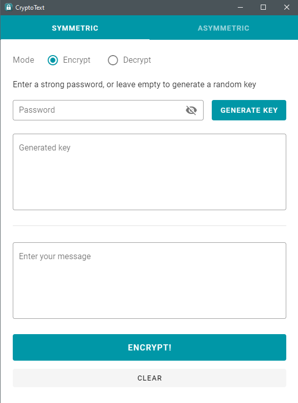
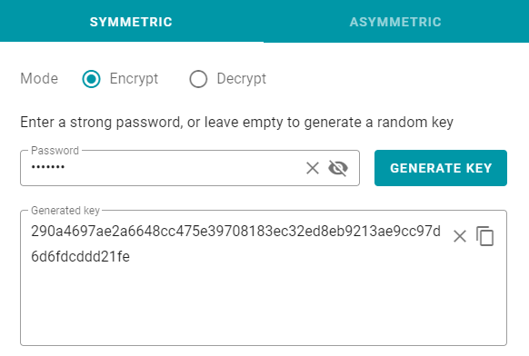
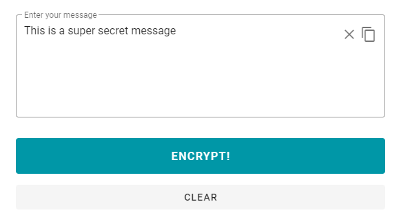
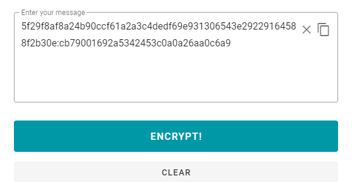
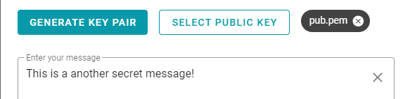

# CryptoText
This project uses `Vue 2` and `Electron 13`. This app is suitable for demonstration purposes only.
## Development
### Prerequisites
- Node >= `16.13.12`
- NPM >= `7.14.0`
- Vue CLI `latest`

Clone the repository, run `npm install` to install the dependencies.

### Serve
To serve the application with hot reload.
```
npm run electron:serve
```
### Project structure
Electron configuration is stored in `vue.config.js` file.

```
public/
resources/
src/
├─ electron/
│  ├─ asymmetric.js
│  ├─ symmetric.js
│  ├─ background.js
├─ vue/
vue.config.js
```

## Installation

### Build
- To build the application run below command. Build files will be output to `bin/Desktop` directory.
```
npm run electron:dev
```

- This application is built and tested on Windows 10. Other platforms are not tested yet.

- After building the application, run the setup in `bin/Desktop` directory. After the installation app will automatically open.

- To directly run the app without installing, run the executable file in `bin/Desktop/win-unpacked`.

## Usage
Initial UI.



## Symmetric encryption and decryption (AES)
- A symmetric key can be generated by clicking on the `Generate Key` button.
- A password can be supplied, or it can be left empty to automatically generate a random password.




- After generating a key, enter your secret message into below textarea and click encrypt button.




- Upon clicking encrypt, the message will be replaced by the ciphertext.



- Copy both ciphertext and key into clipboard. Switch to decrypt mode and paste key and ciphertext into relevant fields.

- Upon clicking decrypt button, decrypted text will be displayed.

### Asymmetric encryption and decryption (RSA)
- A key pair can be generated and saved in `.pem` format by clicking on `generate key pair` button. It will open a dialog to indicate save location.

- Select your desired location in the computer and `pub.pem` and `pri.pem` will be saved there. It may take a few moments to generate keys.

- Then, enter a secret message in the field and select the generated public key using `select public key` button in order to encrypt it. The selected key name will be displayed next to the button.



- Click the encrypt button, and the ciphertext will be displayed in the below textarea.

- Copy the ciphertext and switch to decrypt mode.

- Paste the ciphertext into the textarea and select the private key using `select private key` button.

- Click the decrypt button to decipher the text.

- Done!

_Code quality is pretty ridiculous. Contributions are welcome._
### Attributions
- App icon was created by Alessandro Roncone. Please check out his work [here](https://github.com/alecive) and [here](https://iconarchive.com/artist/alecive.html).